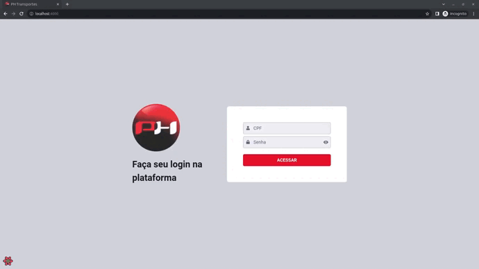

<br /><br />

<h4 align="center">

</h4>

<h1 align="center">Controle de carga</h1>

<br /><br />

# 💡 Sobre

**Projeto acadêmico da disciplina de Laboratório de simulação e prototipagem, ULBRA-RS 2023/1**
<br/>
Construído uma aplicação fullstack para controle de cargas.

<br />

# ⚙️ Como rodar

### 📃 Pré-requisito

- **Node** v18.16.0

### 💻 No PC

- **Clonar repositório**
- **Necessário abrir DOIS terminais para rodar o backend e frontend**

### ◼️ Terminal 1

- **Dentro da pasta "backend":**

```bash
# Baixar dependências
$ yarn

# Rodar API
$ yarn start:dev
```

### ◼️ Terminal 2

- **Dentro da pasta "frontend":**

```bash
# Baixar dependências
$ yarn

# Rodar aplicação ReactJS
$ yarn dev
```

<br />

# 📲 Funcionalidades

### 🚛 Motorista


<br />

### 🙍 Administrador



<br />

# 💻 Tecnologias

### BACKEND

- Fastfy
- Json Web Token (JWT)
- Prisma ORM
- SQLite

### FRONTEND

- ReactJS
- Chakra UI
- Apexcharts (graphics)

<br/>

 
